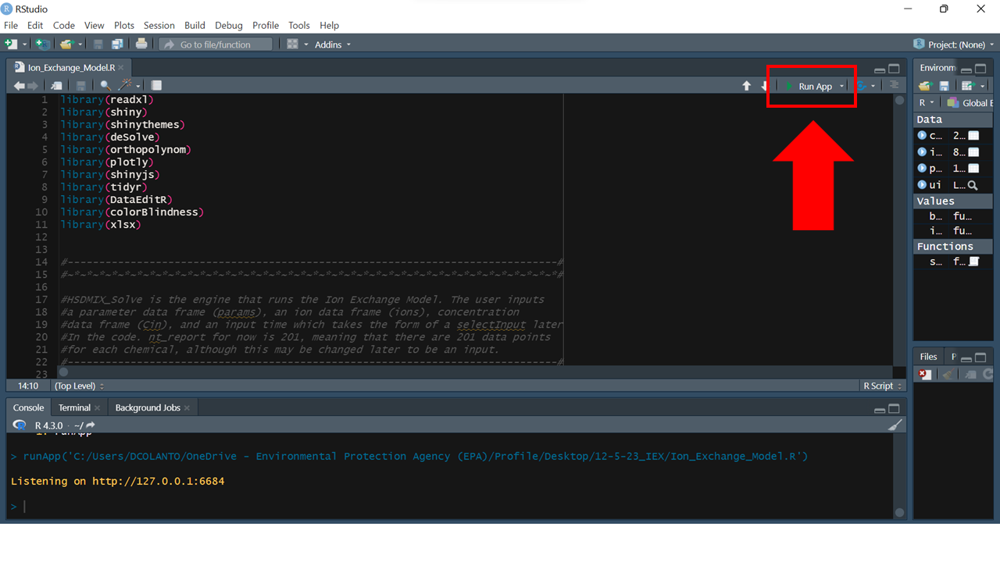
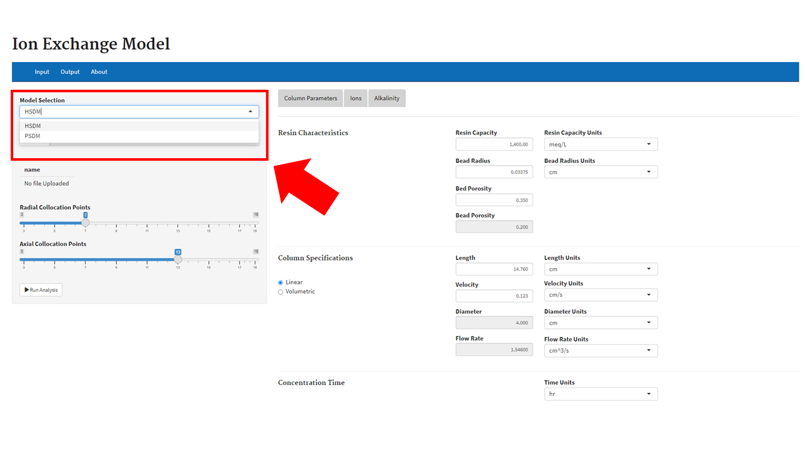
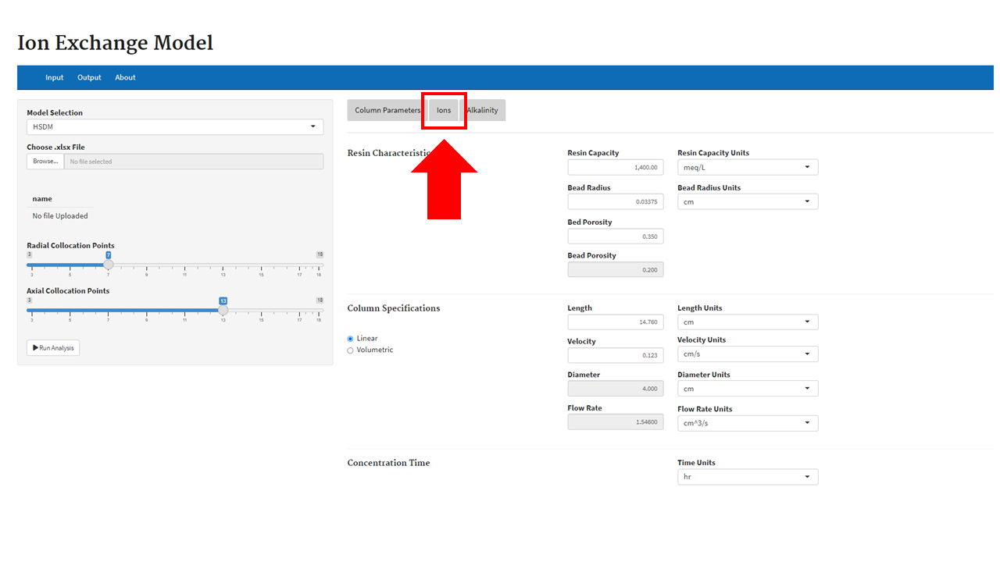
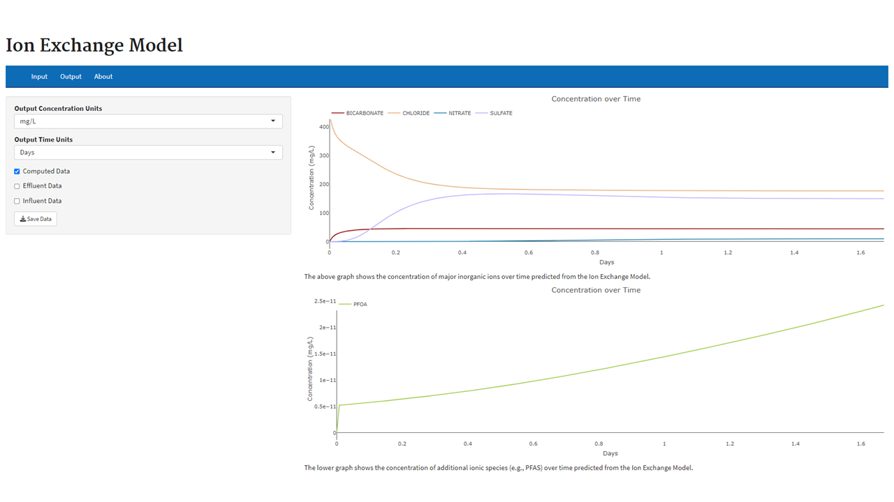
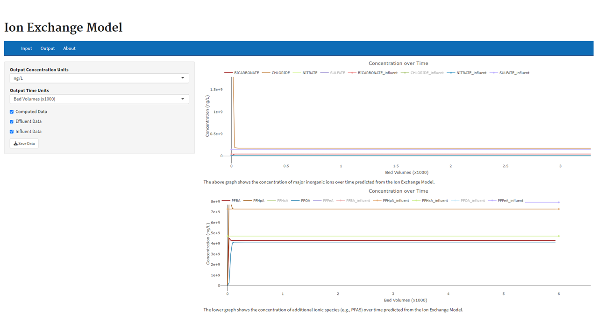
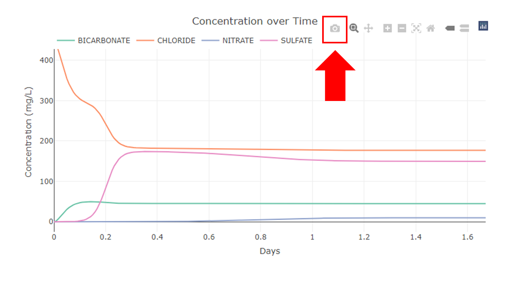
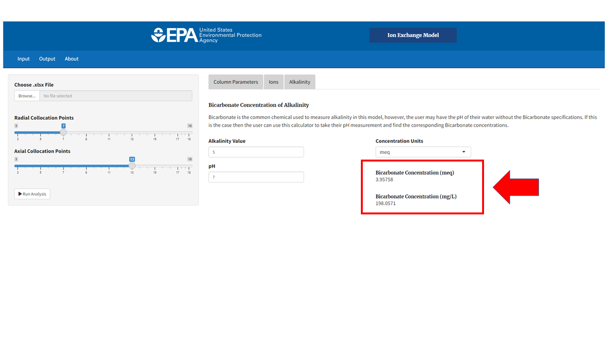

# Ion Exchange Modeling Tool

The Ion Exchange Model is a tool used to model a strong-base anion exchange unit operation in a drinking water treatment plant. This model relies on selectivity coefficient parameters and other information about the anion exchange resin and predicts the breakthrough behavior for unit operation design. To read a further in-depth analysis of the theory behind this model please reference [Anion Exchange Resin and Inorganic Anion Parameter Determination for Model Validation and Evaluation of Unintended Consequences during PFAS Treatment](https://pubs.acs.org/doi/10.1021/acsestwater.2c00572)[1](#1).

1. [Requirements](#requirements)
2. [Excel Formatting](#excel-based-input-file)
3. [Quick Start](#quick-start)
4. [Appendix](#appendix)
5. [Notes to the User](#notes-to-the-user)
6. [Development Team](#development-team)

## Requirements 
1. R/R Studio (At least version 2022.7)
2. Excel (recommended)
3. Files: Ion_Exchange_Model.R, config.xlsx
4. Optional: example.xlsx

## Excel-based Input File
The input for the Excel-based input file must be formatted like the one shown in the figure below if the user wants to import data. HSDM looks for sheetnames of "params", "ions" and "Cin". If one or more of those sheets are not found then the app cannot be run using that input file. The app is loaded with default data if the user does not want to use an Excel-based file, and additional changes can be made within the GUI. There is a fourth optional sheet "effluent", which represents data from a previous model or experiment. This does not need to be present when the file is ran and is not required to exist in the excel sheet.

<figure>
    
</figure>

<figure>
     
     <figcaption>The excel file consists of three sheets: parameters of the system, the list of ions that the user is interested in along with their properties, and the list of concentrations for the ions at a given time. Each tab is broken down in detail in the features section of this document.
    * Dp and Dp_units are provided in example input files. These are required for PSDM modeling but will be ignored for HSDM modeling.
    </figcaption>
</figure>

&nbsp;

## Available Models
* HSDM: Homogeneous Suface Diffision Model - Used for gel-type resin systems
* PSDM: Pore and Surface Diffusion Model - Used for macroporous resin systems

## Quick Start

1. In RStudio, click the "Run App" button in the top right corner of the window that contains the code

2. Click import file in the top left of the Interface

3. Click the drop down selector named "Model Selection" to chose between "HSDM" and "PSDM"

4. (Optional) Change the parameters to match the specifications of your Ion Exchange apparatus

5. (Optional) In the ions tab, add chemicals and concentration points to match your interest. These can be added or edited by right clicking the data table.

6.	Click the Run Analysis button that’s at the bottom of the same side panel as the file import. 5 total chemicals with 2 concentration points takes about 1-2 minutes.

7.	Switch to the output tab (There should be a loading “spinner” to let you know it’s running)

8.	Your graph will appear. You can export the data as an xlsx file along with the conditions you input.

9. The user can use the buttons on the left to toggle the influent data and the effluent data (if available). Note that the user can toggle on and off individual traces on the graph by clicking on the desired data on the legend (data will be grayed out if it isn't displayed).

## Appendix

### Column Parameters

The Column Parameters tab (Input>Column Parameters) is used to describe the resin characteristics and column specifications. Some of these parameters, like Resin Capacity, can be nontrivial to measure so appropriate references are provided where a user can find additional information. This information is located in the "params" tab in the Excel-based input files.

The parameters tab is used to describe the physical constraints of the resin characteristics and column specifications. Some of these measurements, like Resin Capacity, can be nontrivial to measure so we have tried to supply a source where the user can find the information if they do not have it already.

|  Input        				|Variable  | Description    |
|---            				|---       |---            |
|Resin Capacity 				|     Q    | Resin capacity is a measurement of the total capacity of anions that can be absorbed by a volume of resin. This capacity is expressed in molar quantity per unit volume (meq/L, molar equivalent per liter). The value is determined experimentally by titration. It is usually reported by the manufacturer.  [Read More](https://pubs.acs.org/doi/10.1021/acsestwater.2c00572)    |
|Bead Radius    				|     rb   | Bead radius is the measurement of the distance of the bead resin from the center to the surface.              |        
|Bed Porosity   				|     EBED | The bed porosity is the measure of a bed volume occupied by a solvent, usually water. This factor is between 0 and 1, where 0 represents a bed absent of a particular solvent and 1 is a bed where all the available space is filled with solvent.     |              
|Bead Porosity | EPOR | The bead porosity is the measure of the bead volume occupied by a solvent, usually water. The factor is between 0 and 1, where 0 represents a bead absent of a solvent and 1 is a bead where all the available space is filled with a solvent. A well packed bead will typically have and EPOR of 0.2. |
|Length         				|     L    |The depth of the media in packed column. Some vessels may only be filled partially, so this number may be shorter than the height of the contractor. |        
|Velocity  					|     v    | The linear velocity, or superficial velocity, represents the distance an average water particle travels over a given period of time. HSDM only considers an average of steady-state condition, not variable flow.     |    
|Diameter 				|     diam    |  The diameter of a cylindrical column.             |        
|Flow Rate 					|	flrt   | The average flow rate through the column. HSDM only considers and average or steady-state condition, not variable flow. |       
|Radial Collocation Points		|	nr   | Number of grid points in the radial direction used to model transport inside the resin beads (Default nr=7). Can be used to adjust numerical convergence.               |        
|Axial Collocation Points		|	nz   | Number of grid points in the axial direction used to model transport through the column (Default nz=13). Can be used to adjust numerical convergence.                |        
|Time                         | time |  The units for time in the corresponding "Cin" sheet in the Excel-based files or "Concentration Points" table under Input>Ion's tab. 

### Ions Tab

The Ions tab contains information about the ions to be simulated. The Ions tab should contain any anionic species found in the system, as HSDM always models a simultaneous competitive exchange process (counterions like sulfate, nitrate, chloride, and bicarbonate must also be modeled in simulations). Ion characteristics (molecular weight, selectivity, valence, mass transfer coefficients) are stored in the "ions" tab in Excel-based input files and listed under "Ion List" within HSDM under the Input>Ions tab. information on concentrations within the system over time are stored in the "Cin" tab in Excel-based input files or "Concentration Points" within HSDM under the Input>Ions tab.

**Note:** Order of rows in the ions table should match order of columns in the Cin table.

|  Input        	                |Column Name   | Description                                                                      |
|---            				    |---        |---                                                                               |
|Molecular Weight               |mw         |Molecular weight of ionic species. Gram per mol.                                          |           |
|Selectivity                   |KxA        |Reactivity of an ion relative to chloride.   [Read More](https://pubs.acs.org/doi/10.1021/acs.est.1c00769) |                     
|Valence                            | valence          |The number of electrons that a given element or chemical can lose.                |
|Film Transfer Coefficient      |kL         |Film transfer diffusion coefficient. Mass transfer coefficient in the boundary of the beads                            |
|kL_units|   kL_units | Units for kL (acceptable inputs: cm/s or m/s)|
|Surface Diffusion Coefficient  |Ds         |Diffusion coefficient of the chemical in gel-type media (HSDM), or along the media surface in macroporous media (PSDM)  |      
|Ds_units|  Ds_units| Units for Ds (acceptable inputs: cm^2/s or m^2/s) |
| Pore Diffusion Coefficient | Dp | Diffusion coefficient of the chemical in the water within pores of a macroporous media (PSDM). Unused in HSDM.|
|Dp_units| Dp_units| Units for Dp (acceptable inputs: cm^2/s or m^2/s) |
|Concentration units| conc_units| Units of corresponding concentration units in Cin. (acceptable units: meq, mg, ug, ng) All assumed to be per liter.|

### Concentration Points / Influent Data

The Concentration Points table (stored in Excel-based files in the "Cin" sheet) represents time series of concentrations in the system over time (conc_units for an ion defines the concentration units for each column). NOTE: The duration of a simulation is specified by the largest time/last row in the Time column. Times in this table should be specified in ascending order, and a minimum of two (2) rows are needed to run a simulation (time 0, and run duration). If concentrations are the same in all rows, the simulation has a constant concentration, but variable concentrations can be modeled (where linear interpolation is used between points). Time units for the times in this table is specified on the "Input>Column Parameters" tab as time (day or hr). This data can be plotted as well by simply clicking the "Influent Data" button on the 'Output' page.

### Effluent Data

The effluent data represents the results from a previous experiment or results from a previous model. This data does not need to be present for the model to run. If the user would like to see this data on the plot, the data must be present on the fourth sheet of the input excel file. When the analysis has been ran, the user can toggle on the "effluent data" button on the left hand side to see the data ploted. The units that the effluent data is in is represented by the 'conc_units' column in the ions tab, the second sheet. Whatever unit corresponds to the chemical in the 'conc_units' tab will be converted to the 'Output Units' on the output page. If the user is not careful the effluent data may seem like it is plotting incorrect values do to the inconsistencies. Moreover, if the user wants to plot the effluent data then the chemical the user wishes to plot must exist in both the 'ions' page, the 'cin page', and the 'effluent page'.

### Output
The Output tab provides a graphical output of results after a simulation is completed. The units for time and concentration can be adjusted via the dropdown menus in the left-hand column.

The graphs will dynamically update to reflect the current selection. If c/c0 is selected, the output is scaled relative to c0 (the initial concentrations), which is the first row of the "Concentration Points" table. "Bed volumes x1000" presents time in thousands of bed volumes treated, where bed volume is the empty bed volume of the media in the system (relating to bed length if velocity is specified, or bed length and diameter if flow rate is specified).

The data can be exported by clicking the save button. This saves the data points to an excel file where the chemicals inputted into the analysis are the header and the columns are the corresponding concentration points with the first column being the corresponding time.

To export the graph, the user can hover over the graph with their cursor which will display the graph settings in the top right. Clicking the camera icon will open up a file explorer where the user can save the graphic.

## Notes to the User

#### Resin Capacity (Q)
The total ion exchange capacity of the resin (Q) is one of the critical input parameters in the HSDMIX Shiny application. This quantity is defined as the concentration of available exchange sites per unit volume inside a resin bead. This basis is used in the underlying model equations. However, several other conventions for defining this quantity are used in practice. The filter capacity (Qf) is commonly provided by resin manufacturers and corresponds to the concentration of fixed sites per volume of the resin bed (that is, the filter). The values of Q and Qf are related by bed porosity ($\epsilon$) [EBED in HSDMIX] through equation 1.

Typical units for Q and Qf in the literature are meq/mL, meq/L, or eq/mL. Alternatively, the ion exchange capacity of a resin is sometimes defined on a dry weight basis (Qm). The dry weight capacity can be related to Q either by apparent resin density ($\rho$a)[RHOP in a Python version of HSDMIX], which is the dry mass of a pellet divided by the pellet's volume when fully hydrated, or through the apparent resin density of the bed ($\rho$*), which is the mass of dry resin per filter volume. The relationships between Qm and Q are given by equation 2.

Because resin volume and density can change with ionic composition of the resin, Q, Qf, and Qm may be different for resin in different ionic forms (for instance, hydroxide vs chloride forms of anion exchange resins). There is also some variability in the literature on what is considered "dry" (completely dry, or air dry) for Qm. The user is advised to carefully check data sources for resin capacity carefully on these matters. 

#### Selection of Collocation Points (nr and nz)
The parameters nr and nz control the size of the grid used to numerically solve the underlying differential equations during the simulation. Increasing nr and nz may increase the accuracy of simulations but doing so also makes them take longer to run. No analytical expression has been found for determining optimal grid dimensions for this class of problems, so selecting nr and nz may take some experimentation. Generally, the sharper the ion exchange zone is relative to the column length, the higher nz will need to be and the sharper the diffusion gradient in the resin beads becomes, the higher nr will need to be. In practice, it is rare for nr to be the controlling parameter for grid size, with nr=7 being accurate enough for most cases without unduly increasing computational cost. The parameter nz is more likely to need attention. Setting nz too low will often produce erroneous oscillations in the breakthrough curves. The illustration below shows simulations with (a) and without (b) these erroneous oscillations.

If increasing nz does not smooth out the erroneous oscillations, there may be other problems with the simulation. In this case, the user is advised to double check the inputs for errors. If there are no errors in the inputs, it is possible the ion exchange zones in the requested simulations are simply too sharp for this numerical approximation to handle. Faced with this problem, the user may wish to consider reducing the empty bed contact time of the simulation or seek out an alternate method of solution such as an equilibrium-based column model.

#### Specifying Column Size and Flow Rate

The underlying model equations in this code use column length (bed depth), L, to define filter size and superficial (linear) flow velocity, v, to define flow rate of simulated systems. If both parameters are readily available to the user, they can be input directly selecting the “linear” radio button on the left side of the column specification section. In practice, flow in adsorption systems is often specified as a hydraulic loading rate (or “surface loading rate”) given in units of volumetric flow rate divided by area (for instance, with units of gpm/ft2 or gallons per minute per square foot). This specification is ultimately equivalent to specifying a superficial flow velocity and can also be entered directly for v provided appropriate units are selected from the corresponding drop-down menu. 

Occasionally design specification may include bed dimensions and empty bed contact time (EBCT) but omit flow information. In this case, the user can obtain a superficial flow velocity from the following formula:

The column size and flow rate may also be defined in terms of L, bed diameter (d), and volumetric flow rate (flrt) by selecting the “volumetric” radio button.
A note on selection of flow convention: The entry field for the two conventions are independent. The values shown in disabled fields (gray backgrounds) are not updated to correspond to values entered using the other convention. Thus, switching between the radio buttons usually results in switching between two different systems.

**Note:** If flow rate is provided, diameter is required

#### Handling Alkalinity

Bicarbonate is the chemical used in this model to measure alkalinity. Some users may find that they are interested in the alkalinity of their water and want to observe how it is affected over time. To do this, we can treat the Bicarbonate in the ions tab as alkalinity (this ion can be renamed manually in the xlsx file or within the app). The corresponding Bicarbonate concentration level will need to be calculated from the measured alkalinity. There is a Bicarbonate concentration calculator within the app that takes a pH level and returns the corresponding Bicarbonate concentration level. To breifly summarize, if the user has alkalinity and wants to use that in their model, use Bicarbonate in the ions tab and replace "BICARBONATE" with "ALKALINITY" then use the alkalinity calculator to find and replace the correpsonding pH with mass per volume.

## References
ACS EST Water 2023, 3, 2, 576–587
Publication Date:January 19, 2023
https://doi.org/10.1021/acsestwater.2c00572

Environ. Sci. Technol. 2021, 55, 8, 5001–5011
Publication Date:March 22, 2021
https://doi.org/10.1021/acs.est.1c00769

## Development Team
David Colantonio

Levi Haupert

Jonathan Burkhardt
